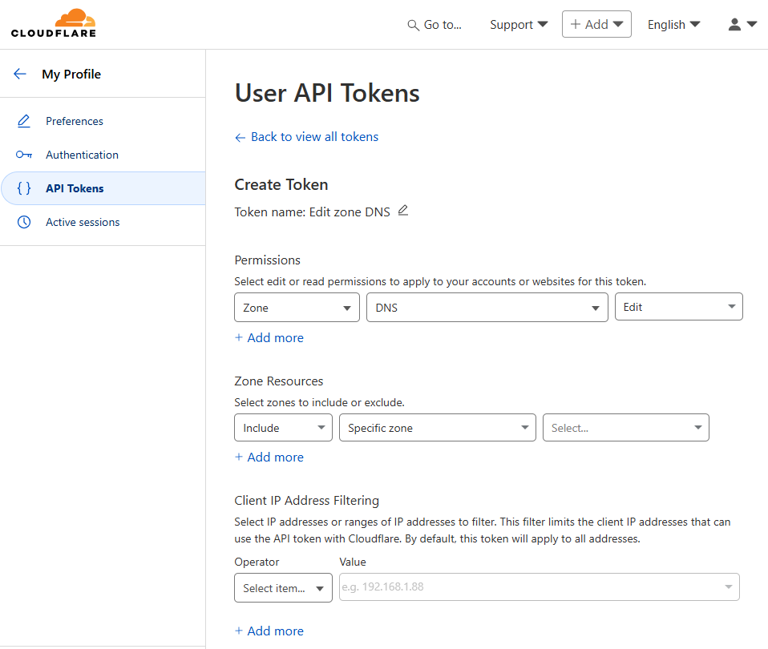

🌐 DynCFDNS 
=====================================

## Table of contents
- [5 Ws](#5-ws)
- [Features](#features)
- [Future Enhancements:](#future-enhancements)
- [Prerequisites](#prerequisites)
- [Environment Variables](#environment-variables)
- [Getting CloudFlare Credentials](#getting-cloudflare-credentials)
- [Python Installation](#python-installation)
- [Docker Usage](#docker-usage)
- [Project Structure](#project-structure)
- [Quick Start](#quick-start)
- [Monitoring](#monitoring)
- [Security Best Practices](#security-best-practices)
- [Troubleshooting](#troubleshooting)
- [License](#license)
- [Alternatives](#alternatives)
- [Contributing](#contributing)


## 5 Ws

### What
DynCFDNS is a dynamic DNS update service for CloudFlare domains using Python. In short, it automatically updates your DNS records with your current external IP address at configurable intervals.

With DynCFDNS you no longer need external Dynamic DNS services if you own a domain. It directly integrates with CloudFlare's API to keep your DNS records up-to-date, ensuring your domains always point to the correct IP address. No more DynDNS, No-IP, or other third-party services needed.

This application runs in your own environment, whether in a Docker container, kubernetes pod or directly on your server, providing you full control over your DNS updates.

All you need is to have your zone configured in CloudFlare and the necessary API credentials. DynCFDNS will handle the rest, updating your DNS records automatically based on your current external IP address.

### Why
I wanted to create a simple, efficient, and secure way to manage dynamic DNS updates for my CloudFlare domains without relying on third-party services. This project aims to provide a lightweight solution that can be easily deployed in various environments, including Docker and Kubernetes, as well as run in my VPS on OCI and AWS. However, I wanted something that could update several records at a time for the same external IP, because that is a scenario I have.

### Who
DynCFDNS is developed and maintained by [AlxDroidDev](https://github.com/AlxDroidDev)

### Where
São Paulo, SP, Brazil

### When
This project was started in July 2025.


## Features

- Automatic DNS record updates at configurable intervals
- Support for multiple hosts/domains
- Secure CloudFlare API integration
- Docker support with Docker Compose
- Comprehensive logging and error handling
- Environment-based configuration
- Minimal Docker image
- Healthcheck included for monitoring

## Future Enhancements:

- Allow for the creation of new DNS records if they do not exist
- Support for IPv6 addresses
- Integration with other DNS providers (AWS Route 53, DigitalOcean, Azure, GCP, etc.)
- Web interface for configuration and monitoring
- Notification system for update failures

##  Prerequisites

- Cloudflare account with API access
- Domain(s) managed by Cloudflare
- Python 3.8+ or Docker 

## Environment Variables

| Variable | Description | Required | Default | Example |
|----------|-------------|----------|---------|---------|
| `HOST_LIST` | Comma-separated list of hostnames to update | ✅ | - | `home.example.com,server.example.com` |
| `CLOUDFLARE_API_TOKEN` | CloudFlare API Token | ✅ | - | `your_api_token_here` |
| `CLOUDFLARE_API_KEY` | CloudFlare Global API Key | ✅ | - | `your_api_key_here` |
| `CLOUDFLARE_API_EMAIL` | CloudFlare account email | ✅ | - | `your-email@example.com` |
| `UPDATE_INTERVAL` | Update interval in minutes | ❌ | `60` | `30` |

### Getting CloudFlare Credentials

1. **API Token** (Required):
   - Go to [CloudFlare Dashboard](https://dash.cloudflare.com/profile/api-tokens)
   - Click "Create Token"
   - Use tthe template "Edit zone DNS" or create a custom token with the following permissions:
       - Permissions:
            - Zone: DNS -> Read
       - Zone Resources:
            - Include: All zones or only the zones you want to manage
       - Client IP Address filtering (Optional):
            - You can restrict the token to specific IP addresses for added security.



2. **Global API Key**:
   - Go to [CloudFlare Dashboard](https://dash.cloudflare.com/profile/api-tokens)
   - Click "View" next to "Global API Key"

## Python Installation

### Install Dependencies

```bash
pip install -r requirements.txt
```

### Run the Application

```bash
export HOST_LIST="home.example.com,server.example.com"
export CLOUDFLARE_API_TOKEN="your_api_token"
export CLOUDFLARE_API_KEY="your_api_key"
export CLOUDFLARE_API_EMAIL="your-email@example.com"
export UPDATE_INTERVAL="60"

python main.py
```

## Docker Usage

### Build Docker Image

```bash
docker build -t dyncfdns .
```

### Run with Docker

```bash
docker run -d \
  --name dyncfdns \
  --restart unless-stopped \
  -e HOST_LIST="home.example.com,server.example.com" \
  -e CLOUDFLARE_API_TOKEN="your_api_token" \
  -e CLOUDFLARE_API_KEY="your_api_key" \
  -e CLOUDFLARE_API_EMAIL="your-email@example.com" \
  -e UPDATE_INTERVAL="60" \
  dyncfdns
```

### Docker Compose

Create a `docker-compose.yml` file:

```yaml
version: '3.8'

services:
  dyncfdns:
    build: .
    container_name: dyncfdns
    restart: unless-stopped
    environment:
      - HOST_LIST=home.example.com,server.example.com
      - CLOUDFLARE_API_TOKEN=your_api_token
      - CLOUDFLARE_API_KEY=your_api_key
      - CLOUDFLARE_API_EMAIL=your-email@example.com
      - UPDATE_INTERVAL=60
    # Optional: Use environment file
    # env_file:
    #   - .env
```

#### Using Environment File

Create a `.env` file:

```env
HOST_LIST=home.example.com,server.example.com
CLOUDFLARE_API_TOKEN=your_api_token
CLOUDFLARE_API_KEY=your_api_key
CLOUDFLARE_API_EMAIL=your-email@example.com
UPDATE_INTERVAL=60
```

Update `docker-compose.yml`:

```yaml
version: '3.8'

services:
  dyncfdns:
    build: .
    container_name: dyncfdns
    restart: unless-stopped
    env_file:
      - .env
```

### Run with Docker Compose

```bash
# Start the service
docker-compose up -d

# View logs
docker-compose logs -f

# Stop the service
docker-compose down
```

## Project Structure

```
DynCFDNS/
├── main.py              # Main application entry point
├── requirements.txt     # Python dependencies
├── Dockerfile          # Docker build configuration
├── docker-compose.yml  # Docker Compose configuration
├── .env.example        # Environment variables template
├── .gitignore         # Git ignore file
└── README.md          # This documentation
```

## Quick Start

1. **Clone the repository**:
   ```bash
   git clone https://github.com/AlxDroidDev/DynCFDNS.git
   cd DynCFDNS
   ```

2. **Set up environment variables**:
   ```bash
   cp .env.example .env
   # Edit .env with your CloudFlare credentials and host list
   ```

3. **Run with Docker Compose**:
   ```bash
   docker-compose up -d
   ```

4. **Check logs**:
   ```bash
   docker-compose logs -f dyncfdns
   ```

## Monitoring

### View Logs

```bash
# Docker Compose
docker-compose logs -f dyncfdns

# Docker
docker logs -f dyncfdns

# Python (if running directly)
# Logs are printed to stdout
```

### Health Check

The application includes built-in health monitoring:
- Successful updates are logged
- Failed updates are logged with error details
- Next update time is displayed

## Security Best Practices

- Use API tokens instead of global API keys when possible
- Limit API token permissions to only what's needed
- Never commit credentials to version control
- Regularly rotate API credentials - but remember to update your environment variables accordingly
- Use environment files or secrets management

## Troubleshooting

### Common Issues

**DNS records not updating**:
- Verify CloudFlare credentials are correct
- Ensure hostnames exist in CloudFlare DNS
- Check CloudFlare API permissions

**Application exits unexpectedly**:
- Check environment variables are set correctly
- Verify network connectivity
- Review application logs

**High memory usage**:
- Consider increasing update interval
- Monitor system resources

### Debug Mode

To run with verbose logging:

```bash
# Add DEBUG environment variable
export DEBUG=true
python main.py
```

## License

This project is licensed under the MIT License - see the LICENSE file for details.

## Contributing

1. Fork the repository
2. Create a feature branch (`git checkout -b feature/amazing-feature`)
3. Commit your changes (`git commit -m 'Add amazing feature'`)
4. Push to the branch (`git push origin feature/amazing-feature`)
5. Open a Pull Request

## Alternatives

If you are looking for alternatives, consider:

#### [ddclient](https://github.com/ddclient/ddclient) 
&nbsp;&nbsp;&nbsp;&nbsp;&nbsp;&nbsp;PERL-based dynamic DNS client, compatible with several DNS providers.
#### [inadyn](https://github.com/troglobit/inadyn)
&nbsp;&nbsp;&nbsp;&nbsp;&nbsp;&nbsp;Lightweight dynamic DNS client supporting multiple providers, built in C, ready for IPv6.
#### [dnsupdate](https://github.com/lopsided98/dnsupdate)
&nbsp;&nbsp;&nbsp;&nbsp;&nbsp;&nbsp;Modern and flexible DNS updater, written in Python. Supports multiple providers, configurable via YAML.

 

## Support

- [Report Issues](https://github.com/AlxDroidDev/DynCFDNS/issues)
- [Discussions](https://github.com/AlxDroidDev/DynCFDNS/discussions)

---

Made with ❤️ by [AlxDroidDev](https://github.com/AlxDroidDev)
